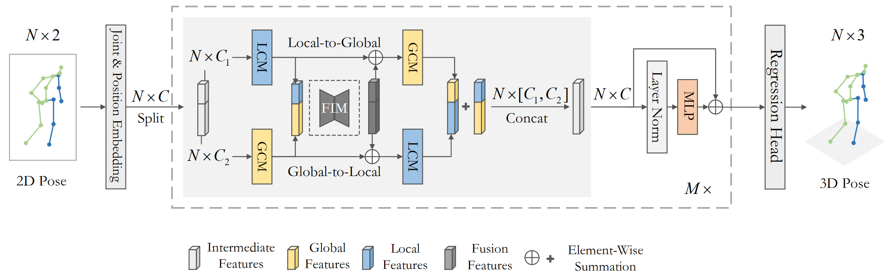

# Double-chain Constraints for 3D Human Pose Estimation in Images and Videos


> [**Double-chain Constraints for 3D Human Pose Estimation in Images and Videos**](https://arxiv.org/abs/2308.05298),             
> Hongbo Kang, Yong Wang, Mengyuan Liu, Doudou Wu, Peng Liu, Wenming Yang  
> *arXiv, 2023*

<p align="center"></p>

## Results on Human3.6M

Protocol 1 (mean per-joint position error) when 2D keypoints detected by CPN, HRNet and the ground truth of 2D poses.

| Method |  2D Pose | MPJPE |
|:-------|:-------:|:-------:|
| DC-GCT         | GT |  32.4 mm |
| DC-GCT         | CPN |  48.4 mm |
| DC-GCT  (w/refine) | CPN |  47.4 mm |
| DC-GCT         | HRNet|  47.2 mm |
| DC-GCT  (w/refine) | HRNet |  46.1 mm |


## Dependencies

- Python 3.7+ 
- PyTorch >= 1.10.0

```sh
pip install -r requirement.txt
```


## Dataset setup
Please download the dataset [here](https://drive.google.com/drive/folders/1gNs5PrcaZ6gar7IiNZPNh39T7y6aPY3g) and refer to [VideoPose3D](https://github.com/facebookresearch/VideoPose3D) to set up the Human3.6M dataset ('./dataset' directory). 

```bash
${POSE_ROOT}/
|-- dataset
|   |-- data_3d_h36m.npz
|   |-- data_2d_h36m_gt.npz
|   |-- data_2d_h36m_cpn_ft_h36m_dbb.npz
```

## Download pretrained model
The pretrained model is [here](https://drive.google.com/file/d/11A1k3uOISYV3AeJRKOzKTtw9UHsEuT5B/view?usp=drive_link), please download it and put it in the './ckpt/pretrained' directory.

## Test the model
To test on Human3.6M on single frame, run:

```
python main.py --reload --previous_dir "ckpt/pretrained" 
```

## Train the model
To train on Human3.6M with single frame, run:

```
python main.py --train -n 'name'
```

## Demo


To begin, download the YOLOv3 and HRNet pretrained models [here](https://drive.google.com/drive/folders/1LX5zhZGlZjckgfpNroWsuu84xyyFYE5X) and put it in the './demo/lib/checkpoint' directory.  Next, download the [pretrained model](https://drive.google.com/file/d/11A1k3uOISYV3AeJRKOzKTtw9UHsEuT5B/view?usp=drive_link) and put it in the './ckpt/pretrained' directory. Lastly, Put your own images in the './demo/figure', and run:


```
python demo/vis.py
```


## Citation

If you find our work useful in your research, please consider citing:

    @article{kang2023double,
    title={Double-chain Constraints for 3D Human Pose Estimation in Images and Videos},
    author={Kang, Hongbo and Wang, Yong and Liu, Mengyuan and Wu, Doudou and Liu, Peng and Yang, Wenming},
    journal={arXiv preprint arXiv:2308.05298},
    year={2023}
    }


## Acknowledgement

Our code is extended from the following repositories. We thank the authors for releasing the codes. 
- [ST-GCN](https://github.com/vanoracai/Exploiting-Spatial-temporal-Relationships-for-3D-Pose-Estimation-via-Graph-Convolutional-Networks)
- [MHFormer](https://github.com/Vegetebird/MHFormer)
- [VideoPose3D](https://github.com/facebookresearch/VideoPose3D)
- [StridedTransformer-Pose3D](https://github.com/Vegetebird/StridedTransformer-Pose3D)
- [HTNet](https://github.com/vefalun/HTNet/tree/main)

## Licence
MIT